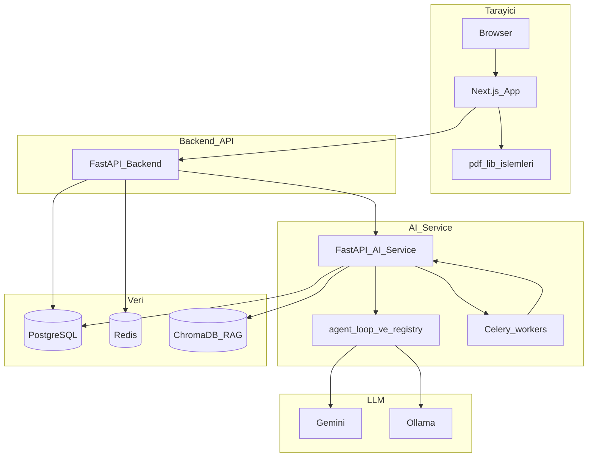
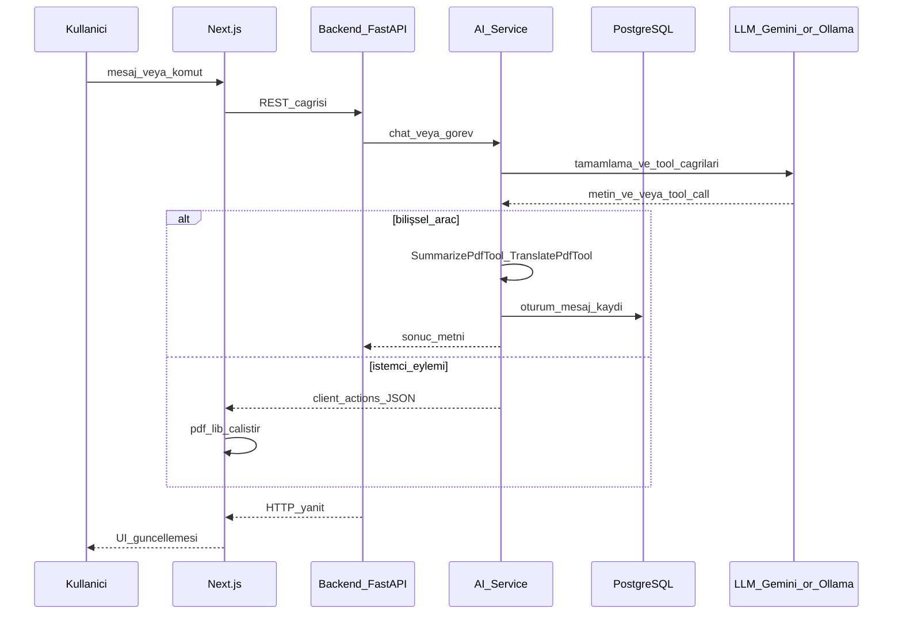

# NeuroPDF — Kurumsal mimari

NeuroPDF, “PDF yükle + tek endpoint” düzeyinde bir sarmalayıcı değildir. **Üç çalışma zamanı** (tarayıcı, backend API, AI servisi), **ayrılmış iş yükü** (istemci pdf-lib vs sunucu bilişsel araçlar), **kalıcı sohbet hafızası** (PostgreSQL + Alembic) ve **sağlayıcıdan bağımsız LLM** (Gemini / Ollama) ile uçtan uca tasarlanmış bir platformdur. UX (magic chips, auto-scroll, ellipsis), DevOps (Husky, GitHub Actions) ve QA (Vitest, Pytest, Playwright + network mock) bu mimariyi destekleyen eşit vatandaşlardır.

---

## İçindekiler

1. [360° sistem görünümü (Mermaid)](#360-sistem-görünümü-mermaid)
2. [İstek yaşam döngüsü ve tool routing](#i̇stek-yaşam-döngüsü-ve-tool-routing)
3. [Karmaşık araç yönlendirmesi (Complex tool routing)](#karmaşık-araç-yönlendirmesi-complex-tool-routing)
4. [Uzun süreli hafıza ve restore](#uzun-süreli-hafıza-ve-restore)
5. [İlgili dokümanlar](#i̇lgili-dokümanlar)

---

## 360° sistem görünümü (Mermaid)

Aşağıdaki diyagram, ana bileşenleri ve veri/çağrı ilişkisini özetler. Düğüm kimliklerinde boşluk kullanılmamıştır.

---

## İstek yaşam döngüsü ve tool routing

Bu sekans, tipik bir sohbet / komut akışında **tool kararının** nerede verildiğini ve çıktının ya **sunucuda bilişsel araç** olarak mı yoksa **istemci eylemi** olarak mı tüketildiğini gösterir.

---

## Karmaşık araç yönlendirmesi (Complex tool routing)

### Ajan döngüsü ve `<tool_call>` ayrıştırması

AI servisi, LLM çıktısından yapılandırılmış **`<tool_call>...</tool_call>`** bloklarını ayrıştırır (`aiService` içinde `parse_tool_calls`). Her çağrı bir **araç adı** (`name`) ve **argüman nesnesi** (`args`) taşır. `registry` üzerinden eşlenen araç `execute` edilir; sonuç ya düz metin ya da **`ToolRunResult`** ile birlikte **`client_actions`** listesi olabilir.

Bu ayrım kritiktir:

- **Bilişsel araçlar** (ör. `SummarizePdfTool`, `TranslatePdfTool`): Sunucuda PDF metni çıkarımı / LLM ile işleme; sonuç metni API üzerinden istemciye döner. Bağlam penceresi ürün gereksinimine göre büyütülebilir (ör. ~20.000 karaktere kadar metin beslemesi).
- **İstemci yönlendirmeli sonuçlar:** Araç çıktısı yalnızca sunucuda bitmez; `client_actions` ile Next.js tarafında **pdf-lib** veya UI komutları tetiklenir. Böylece kesme/birleştirme gibi işler **zero-compute** ilkesiyle tarayıcıda kalabilir.

### LLM sağlayıcı soyutlaması

Aynı ajan mantığı **Gemini** (bulut) veya **Ollama** (yerel) ile çalışacak şekilde soyutlanır; routing kararı iş kurallarına ve yapılandırmaya bağlıdır, tek bir modele kilitlenmez.

### Backend–AI sınırı

Backend (FastAPI) kimlik doğrulama, dosya metadata’sı, rate limit, **sohbet oturumu CRUD** ve AI servisine güvenli köprü görevini üstlenir. Ağır LLM ve RAG işi AI servisinde yoğunlaşır; böylece ölçekleme ve dağıtım ayrışır.

---

## Uzun süreli hafıza ve restore

Sohbet oturumları ve mesajlar PostgreSQL’de saklanır; şema **Alembic** migrasyonları ile evrilir (`backend` içinde `alembic upgrade head`).

Örnek HTTP yüzeyi (backend router, `/files` altında):

| Metod | Yol | Rol |
|--------|-----|-----|
| GET | `/files/chat/sessions` | Oturum listesi |
| GET | `/files/chat/sessions/{session_db_id}/messages` | Mesaj geçmişi |
| POST | `/files/chat/sessions/{session_db_id}/resume` | AI oturumunu devam ettirme |

Bu uçlar, istemcinin geçmiş sohbeti listelemesine, seçince mesajları yüklemesine ve **resume** ile kesintisiz devam etmesine olanak verir. Gerçek implementasyon: [backend/app/routers/files.py](../../backend/app/routers/files.py).

---

## İlgili dokümanlar

| Belge | Konu |
|--------|------|
| [API_REFERENCE.md](../reference/API_REFERENCE.md) | Chat ve dosya endpoint detayları |
| [TEST_STRATEGY.md](../testing/TEST_STRATEGY.md) | Test katmanları ve sayılar |
| [CI.md](../devops/CI.md) | GitHub Actions pipeline |
| [PRE_COMMIT.md](../devops/PRE_COMMIT.md) | Husky ve lint-staged |
| [README.md](../../README.md) | Kurulum ve ürün özeti |

Kod referansları (özet): `aiService/app/core/tools/agent_loop.py` (tool dispatch), `aiService/app/core/tools/__init__.py` (`ToolRegistry` ve varsayılan araç kaydı), frontend’de `pdf-lib` tabanlı sayfa bileşenleri ve `PdfContext` ile global sohbet durumu.
