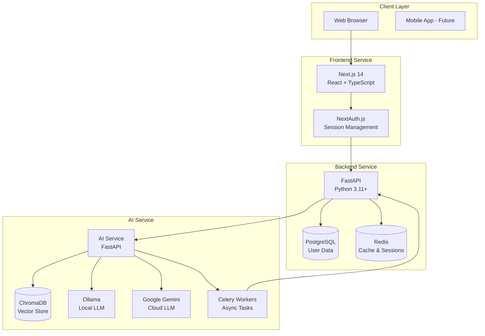
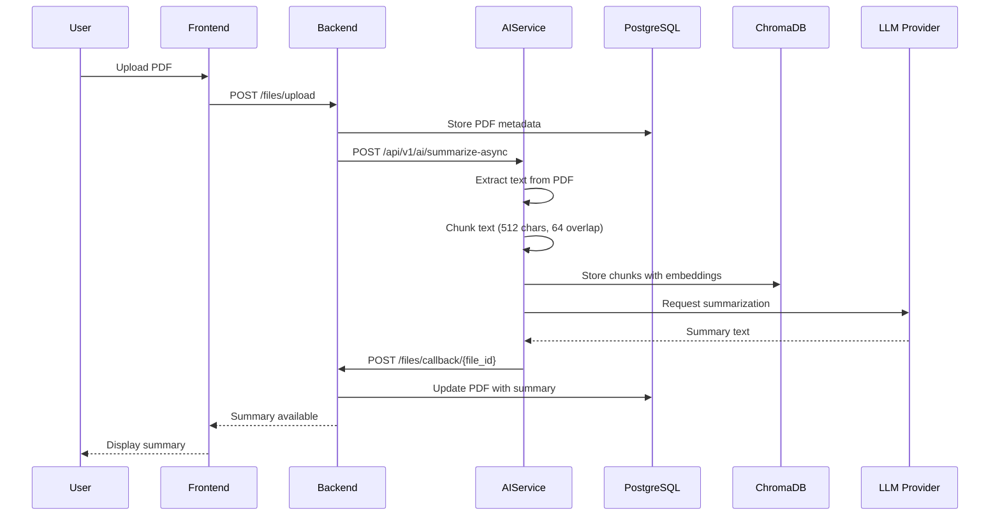
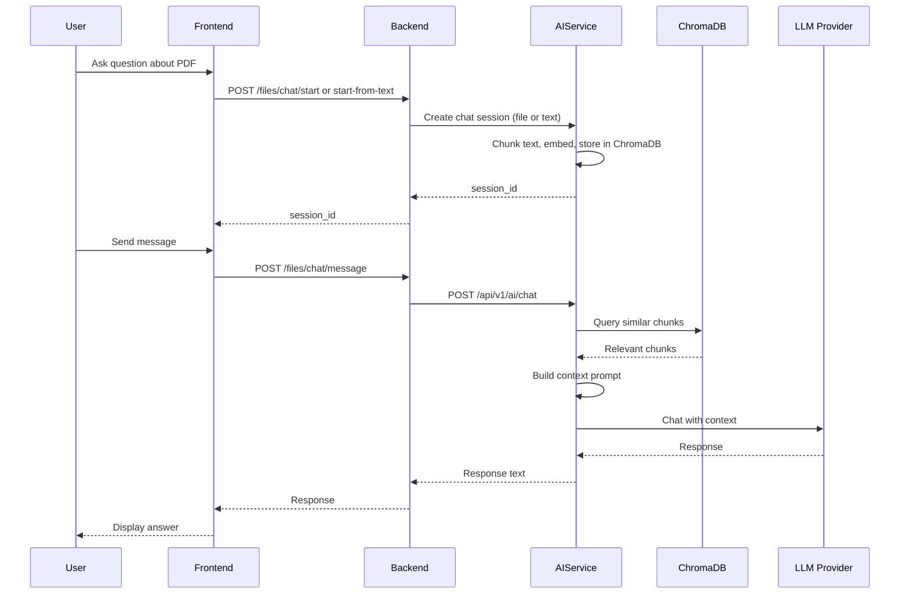
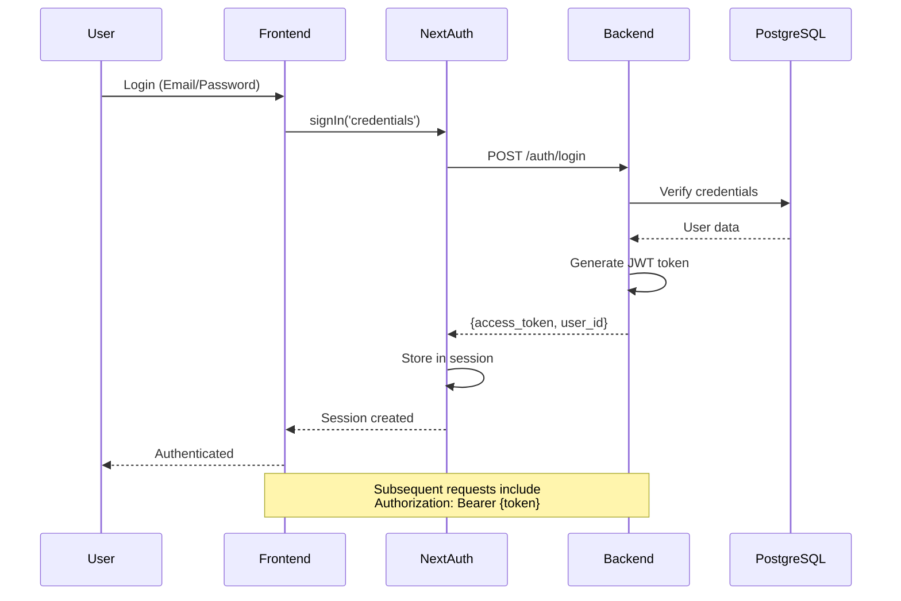
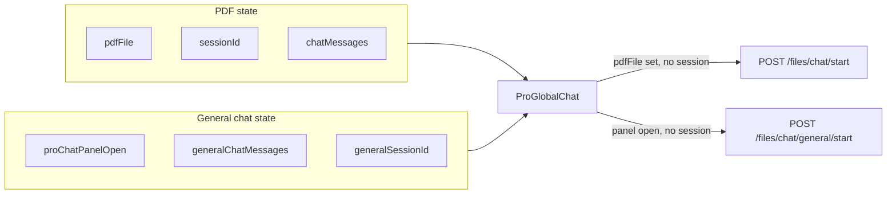
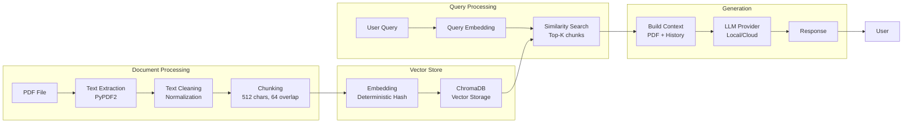

# NeuroPDF Architecture Documentation

## Table of Contents

1. [System Overview](#system-overview)
2. [Architecture Components](#architecture-components)
3. [Data Flow](#data-flow)
4. [Global State and ProChat (Option A)](#global-state-and-prochat-option-a)
5. [Database Schema](#database-schema)
6. [AI Processing Pipeline](#ai-processing-pipeline)
7. [Authentication & Authorization](#authentication--authorization)
8. [Security Measures](#security-measures)
9. [Deployment Architecture](#deployment-architecture)

---

## System Overview

NeuroPDF is a comprehensive PDF processing platform that combines document management with AI-powered summarization and chat capabilities. The system is built using a microservices architecture with clear separation of concerns between frontend, backend, and AI services.

### Key Features

- **PDF Upload & Storage**: Secure document storage with metadata management
- **AI Summarization**: Automated document summarization using LLM (Local or Cloud)
- **RAG-based Chat**: Context-aware conversations about PDF content using Retrieval-Augmented Generation
- **Global ProChat**: Single FAB on all pages; Pro users get a persistent chat panel (general + PDF) with history preserved across navigation; non-Pro users are directed to pricing or an info modal
- **User Management**: Multi-provider authentication (Local, Google OAuth)
- **Guest Mode**: Limited functionality for unauthenticated users

---

## Architecture Components

### High-Level Architecture



### Component Responsibilities

#### Frontend (Next.js)
- **UI/UX**: React components, responsive design
- **State Management**: React Context API, custom hooks
- **Authentication**: NextAuth.js integration with backend
- **API Communication**: RESTful API client with error handling
- **File Upload**: Drag-and-drop, progress tracking

#### Backend (FastAPI)
- **API Gateway**: RESTful endpoints for all operations
- **User Management**: Authentication, authorization, profile management
- **File Management**: PDF storage, metadata tracking
- **Task Orchestration**: Async task coordination with AI Service
- **Rate Limiting**: Redis-based rate limiting for API protection

#### AI Service (FastAPI)
- **PDF Processing**: Text extraction from PDF files
- **LLM Integration**: Local (Ollama) and Cloud (Gemini) LLM providers
- **RAG Pipeline**: Document chunking, embedding, similarity search
- **Chat Management**: Session handling, conversation history
- **Async Processing**: Celery workers for long-running tasks

---

## Data Flow

### PDF Upload & Summarization Flow



### PDF Chat Flow (RAG)

RAG chat has two entry points:

1. **POST /files/chat/start** — Direct file upload (multipart). Used for dynamic PDF integration: when the user has a PDF in context and no PDF session yet, the frontend sends the file to start a session. The file is not stored in the backend DB; it is forwarded to the AI Service, which extracts text, chunks it, and stores embeddings in ChromaDB.
2. **POST /files/chat/start-from-text** — Starts a session from pre-extracted text (e.g. after summarization on the summarize page). Used when the user already has summary text and wants to chat about it.

After a session exists, messages are sent via **POST /files/chat/message**. The async data cycle is: Frontend → Backend → AI Service → ChromaDB (similarity search) + LLM → response back to the user.



**General chat** (no PDF): **POST /files/chat/general/start** starts a session; **POST /files/chat/general/message** sends messages. Same Frontend → Backend → AI Service → LLM cycle, without ChromaDB retrieval.

### Authentication Flow



### Global State and ProChat (Option A)

Chat UI and conversation state are managed in **PdfContext** (Option A: single context for both PDF and global chat). This keeps the panel open/closed and general chat history intact across page navigation.

**State in PdfContext:**

| State group | Fields | Cleared by `clearPdf`? |
|-------------|--------|------------------------|
| PDF | `pdfFile`, `sessionId`, `chatMessages`, `isChatActive` | Yes |
| ProChat panel + general chat | `proChatPanelOpen`, `generalChatMessages`, `generalSessionId` | No |

- **ProGlobalChat** is the only chat component in the layout. On FAB click: if the user is Pro, the panel opens and a general session is started lazily via `POST /files/chat/general/start` when there is no active session; if not Pro, the user is sent to pricing or shown an info modal.
- **Dynamic PDF integration**: When `pdfFile` is set and there is no PDF session yet, ProGlobalChat calls `POST /files/chat/start` (FormData with the file), then updates context with the returned `session_id` and welcome message. The panel then shows PDF-backed chat until the user clears the PDF or starts a new one.



---

## Database Schema

### Entity Relationship Diagram

```mermaid
erDiagram
    USERS ||--o{ USER_AUTH : has
    USERS ||--o| USER_SETTINGS : has
    USERS ||--o| USER_STATS : has
    USERS ||--o{ USER_AVATARS : has
    USERS ||--o{ PDFS : owns
    USERS }o--|| LLM_CHOICES : prefers
    USERS }o--|| USER_ROLES : has
    
    PDFS ||--o| SUMMARY_CACHE : cached_in
    
    LLM_CHOICES ||--o{ USERS : used_by
    USER_ROLES ||--o{ USERS : assigned_to
    
    GUEST_SESSIONS {
        uuid id PK
        int usage_count
        timestamp created_at
        timestamp last_used_at
    }
    
    USERS {
        string id PK
        string username UK
        timestamp created_at
        int llm_choice_id FK
        int role_id FK
    }
    
    USER_AUTH {
        int id PK
        string user_id FK
        string provider
        string provider_key
        string password_hash
    }
    
    USER_SETTINGS {
        string user_id PK_FK
        boolean eula_accepted
        string active_avatar_url
    }
    
    USER_STATS {
        string user_id PK_FK
        int summary_count
        int tools_count
        timestamp created_at
        timestamp last_activity
    }
    
    PDFS {
        string id PK
        string user_id FK
        bytes pdf_data
        string filename
        int file_size
        timestamp created_at
    }
    
    SUMMARY_CACHE {
        int id PK
        string pdf_hash UK
        string summary
        int llm_choice_id FK
        string user_id FK
        timestamp created_at
    }
    
    LLM_CHOICES {
        int id PK
        string name UK
    }
    
    USER_ROLES {
        int id PK
        string name UK
    }
```

### Key Tables

#### Users & Authentication
- **users**: Core user information (UUID, username, LLM preference, role)
- **user_auth**: Multi-provider authentication (local, Google OAuth)
- **user_settings**: User preferences (EULA acceptance, avatar URL)
- **user_stats**: Usage statistics (summary count, tools count)

#### Document Management
- **pdfs**: PDF files stored as binary data (BLOB) with metadata
- **summary_cache**: Cached summaries indexed by PDF hash and LLM provider

#### System Configuration
- **llm_choices**: Available LLM providers (local, cloud)
- **user_roles**: User role hierarchy (default, pro, admin)
- **guest_sessions**: Guest user session tracking

### Relationships

- **Cascade Deletes**: User deletion cascades to PDFs, auth records, settings, stats, and avatars
- **Foreign Key Constraints**: LLM choice and role are restricted (cannot delete if in use)
- **Indexes**: User ID, PDF hash, and username are indexed for performance

---

## AI Processing Pipeline

### RAG (Retrieval-Augmented Generation) Architecture



### Chunking Strategy

The system uses **sentence-aware chunking** with the following parameters:

- **Chunk Size**: 512 characters
- **Overlap**: 64 characters
- **Method**: Sentence boundary detection (splits on `.`, `!`, `?`, `\n`)

This approach ensures:
- Context preservation across chunk boundaries
- Semantic coherence within chunks
- Efficient retrieval of relevant information

### Embedding Function

The system uses a **deterministic embedding function** based on SHA-256 hashing:

```python
def _text_to_vector(text: str, dimension: int = 384) -> list[float]:
    """Convert text to normalized vector using hash-based embedding."""
    h = hashlib.sha256(text.encode("utf-8")).digest()
    values = [(h[i % len(h)] - 128) / 128.0 for i in range(dimension)]
    # Normalize to unit vector
    return [x / magnitude for x in values]
```

**Advantages**:
- No API costs (no external embedding service)
- Deterministic (same text → same vector)
- Fast computation
- Suitable for testing and offline use

**Trade-offs**:
- Less semantic understanding than transformer-based embeddings
- Hash collisions possible (rare)

### Retrieval Process

1. **Query Embedding**: User query is converted to vector using same function
2. **Similarity Search**: ChromaDB performs cosine similarity search
3. **Top-K Selection**: Returns top 5 most similar chunks
4. **Context Building**: Selected chunks + conversation history → LLM prompt

### LLM Provider Selection

Users can choose between:

- **Local LLM** (Ollama): Privacy-focused, no API costs, requires local GPU
- **Cloud LLM** (Google Gemini): Higher quality, API costs, requires internet

The choice is stored in `users.llm_choice_id` and respected throughout the pipeline.

### LLM Mocking in Tests

In the AI Service test suite, LLM output is mocked to avoid external API calls and to assert prompt safety and response format. Tests use markers such as `llm_mock` and cover prompt injection protection and structured output (e.g. JSON/Markdown). ChromaDB/RAG tests (`chromadb` marker) exercise the vector store and retrieval path with deterministic hash-based embeddings.

---

## Authentication & Authorization

### Authentication Flow

```mermaid
graph TB
    subgraph "Frontend (NextAuth)"
        Login[Login Page]
        NextAuth[NextAuth.js]
        Session[Session Store<br/>JWT]
    end
    
    subgraph "Backend (FastAPI)"
        AuthEndpoint[/auth/login]
        JWTGen[JWT Generator]
        UserDB[(User DB)]
    end
    
    Login --> NextAuth
    NextAuth --> AuthEndpoint
    AuthEndpoint --> UserDB
    UserDB --> JWTGen
    JWTGen --> NextAuth
    NextAuth --> Session
    
    Session -->|Bearer Token| API[API Requests]
```

### JWT Token Structure

```json
{
  "sub": "user_id",
  "email": "user@example.com",
  "username": "username",
  "eula_accepted": true,
  "exp": 1234567890,
  "iat": 1234567890,
  "iss": "fastapi"
}
```

### Authorization Levels

1. **Public Endpoints**: No authentication required
   - `/health`
   - `/guest/session`

2. **Guest Endpoints**: Guest session token required
   - `/guest/check-usage`
   - Limited functionality

3. **Authenticated Endpoints**: JWT token required
   - `/files/*`
   - `/auth/*` (except login/register)
   - `/api/v1/user/*`

4. **Role-Based Access**: Role check required
   - **Pro features**: General chat (`POST /files/chat/general/start`, `POST /files/chat/general/message`) and the global ProChat panel are available only to Pro users. The backend enforces this via `_check_pro_user` (Supabase/user_roles). Non-Pro users receive 403 for these endpoints.
   - Admin endpoints (future)

### Session Management

- **Frontend**: NextAuth.js manages sessions in HTTP-only cookies
- **Backend**: JWT tokens validated on each request
- **Guest Sessions**: UUID-based sessions stored in PostgreSQL with TTL

---

## Security Measures

### Prompt Injection Protection

The system implements multiple layers of protection against prompt injection attacks:

#### 1. **Structured Prompt Design**

```python
def _build_chat_prompt(pdf_context: str, filename: str, history_text: str, user_message: str) -> str:
    system_instruction = (
        "Sen bir PDF asistanısın. Kullanıcının yüklediği PDF'e dayanarak cevap ver.\n"
        "Eğer PDF'te açıkça yoksa, bunu belirt ve kullanıcıdan sayfa/başlık gibi ipucu iste.\n"
        "Cevaplarını Türkçe ver, net ve pratik ol.\n"
    )
    
    return f"""
{system_instruction}

DOSYA: {filename}

PDF İÇERİĞİ:
---
{pdf_context}
---

SOHBET GEÇMİŞİ:
---
{history_text}
---

KULLANICI SORUSU:
{user_message}
""".strip()
```

**Protection Mechanisms**:
- Clear separation between system instruction and user input
- User message is placed at the end, reducing injection risk
- System instruction explicitly defines AI role and constraints

#### 2. **Input Validation**

- **Length Limits**: User messages truncated to prevent context overflow
- **Character Filtering**: Special characters sanitized where necessary
- **Type Checking**: Strict type validation on all API inputs

#### 3. **Context Isolation**

- PDF context and user message are clearly delimited
- System instructions cannot be overridden by user input
- History is limited to last 10 messages to prevent context poisoning

#### 4. **Rate Limiting**

```python
# Redis-based rate limiting
def check_rate_limit(request: Request, key: str, limit: int, window: int = 60):
    # Prevents abuse and prompt injection attempts
    redis_key = f"ratelimit:{key}:{client_ip}"
    # ... rate limit logic
```

**Protection**:
- Prevents rapid-fire injection attempts
- IP-based tracking
- Configurable limits per endpoint

### Additional Security Measures

#### 1. **API Key Protection**
- AI Service requires API key for internal communication
- Keys stored in environment variables
- Not exposed to frontend

#### 2. **File Upload Security**
- File type validation (PDF only)
- File size limits (configurable)
- Filename sanitization (path traversal prevention)
- Virus scanning (future)

#### 3. **Database Security**
- Parameterized queries (SQL injection prevention)
- Foreign key constraints (data integrity)
- Cascade deletes (data consistency)

#### 4. **CORS Configuration**
- Restricted origins
- Credentials required for authenticated endpoints
- Preflight request handling

#### 5. **Security Headers**
```python
response.headers["X-Content-Type-Options"] = "nosniff"
response.headers["X-Frame-Options"] = "DENY"
response.headers["X-XSS-Protection"] = "1; mode=block"
response.headers["Strict-Transport-Security"] = "max-age=31536000"
```

---

## Deployment Architecture

### Docker Compose Services

```mermaid
graph TB
    subgraph "Frontend"
        Frontend[Next.js Container<br/>Port 3000]
    end
    
    subgraph "Backend Services"
        Backend[FastAPI Backend<br/>Port 8000]
        Redis[Redis Cache<br/>Port 6379]
    end
    
    subgraph "AI Services"
        AIService[AI Service<br/>Port 8001]
        Celery[Celery Worker]
        Ollama[Ollama LLM<br/>Port 11434]
    end
    
    subgraph "Storage"
        PostgreSQL[(PostgreSQL<br/>External)]
        ChromaDB[(ChromaDB<br/>In-Memory)]
        Volumes[Shared Volumes]
    end
    
    Frontend --> Backend
    Backend --> Redis
    Backend --> PostgreSQL
    Backend --> AIService
    AIService --> ChromaDB
    AIService --> Ollama
    AIService --> Celery
    Celery --> Backend
    AIService --> Volumes
    Backend --> Volumes
```

### Service Dependencies

```
frontend → backend
backend → redis_cache, postgresql (external)
aiservice → redis_cache, ollama
aiceleryworker → redis_cache, aiservice, backend, ollama
```

### Network Architecture

- **app_network**: Bridge network for inter-service communication
- **Port Mapping**: Only necessary ports exposed to host
- **Internal Communication**: Services use Docker service names

### Volume Management

- **shared_uploads**: PDF files shared between backend and AI service
- **ollama_storage**: Ollama model storage (persistent)
- **frontend_node_modules**: Node modules cache (performance)

### Environment Variables

Each service requires specific environment variables:

**Backend**:
- `DB_USER`, `DB_PASSWORD`, `DB_HOST`, `DB_NAME`
- `JWT_SECRET`
- `SUPABASE_URL`, `SUPABASE_KEY`
- `AI_SERVICE_URL`
- `REDIS_URL`

**AI Service**:
- `OLLAMA_HOST`, `OLLAMA_MODEL`
- `GEMINI_API_KEY` (optional)
- `REDIS_URL`
- `API_KEY` (for service-to-service auth)

**Frontend**:
- `BACKEND_API_URL`
- `NEXTAUTH_SECRET`
- `GOOGLE_CLIENT_ID`, `GOOGLE_CLIENT_SECRET`

---

## Performance Considerations

### Caching Strategy

1. **Summary Cache**: PDF summaries cached by hash + LLM provider
2. **Redis Cache**: Session data, rate limit counters
3. **ChromaDB**: Vector embeddings cached in-memory

### Async Processing

- **Celery Workers**: Long-running tasks (summarization) processed asynchronously
- **Webhook Callbacks**: AI Service notifies Backend when tasks complete
- **Polling Fallback**: Frontend polls for status updates

### Database Optimization

- **Indexes**: User ID, PDF hash, username indexed
- **Connection Pooling**: SQLAlchemy connection pool configured
- **Query Optimization**: Eager loading for relationships

### LLM Provider Selection

- **Local LLM**: Faster response, no API latency
- **Cloud LLM**: Higher quality, but network latency
- **User Choice**: Stored in database, respected throughout pipeline

---

## Future Enhancements

### Planned Features

1. **Advanced RAG**: Transformer-based embeddings (e.g., sentence-transformers)
2. **Multi-Modal Support**: Image extraction and OCR for scanned PDFs
3. **Real-Time Collaboration**: WebSocket-based real-time updates
4. **Advanced Analytics**: User behavior tracking, document insights
5. **Export Features**: PDF export with annotations, summary reports

### Scalability Improvements

1. **Horizontal Scaling**: Load balancer for multiple backend instances
2. **Database Sharding**: Partition PDFs by user ID
3. **CDN Integration**: Static asset delivery
4. **Message Queue**: RabbitMQ/Kafka for task distribution

---

## Conclusion

NeuroPDF is built with a focus on:

- **Modularity**: Clear separation between frontend, backend, and AI services
- **Security**: Multi-layer protection against common vulnerabilities
- **Performance**: Caching, async processing, and optimized queries
- **Flexibility**: Support for both local and cloud LLM providers
- **Scalability**: Docker-based deployment ready for horizontal scaling

The architecture supports both development and production environments, with clear paths for future enhancements and scaling.
